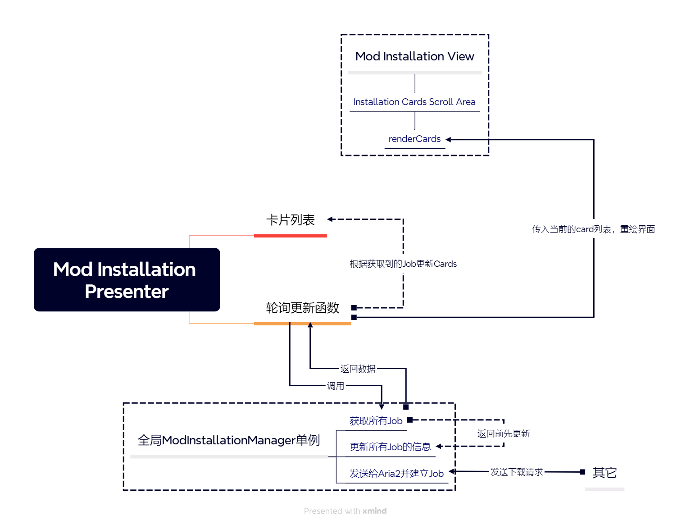

# Pavlov工具箱

## 简介

这是一个集多个实用功能为一体的 Pavlov（一款游戏） 工具箱。

其中包括（或计划包括）但不限于以下功能：

- [x] Mod 的搜索与安装
- [x] 特定服务器需要的 Mod 的安装
- [ ] 本地 Mod 更新
- [ ] Mod 安装路径移动
- [ ] 新手教程
- [ ] 新手常见问题解答

## 概览

### 主要目录和文件

|        名称        | 解释                                                                         |
| :----------------: | ---------------------------------------------------------------------------- |
|      `aria2/`      | aria2的可执行文件和 Python RPC 客户端                                        |
|    `features/`     | App功能相关                                                                  |
|  `generated_ui/`   | 在 Qt Designer 中设计的 UI 和由 pyside6-uic 编译 UI 文件，不作任何手动修改。 |
|    `build.ps1`     | 构建脚本                                                                     |
| `requirements.txt` | 该项目使用的依赖库及其版本                                                   |

### Mod安装相关部分

这一部分比较复杂，为了便于维护，特制作一份原理图。

## 构建

安装完 `requirements.txt` 中的依赖后，运行 `build.ps1` 即可。

## TODO List

- [ ] 重构server_mod界面为MVP架构，提高可维护性。

## 鸣谢

本项目使用了以下第三方软件/包，特此感谢以下软件/包的贡献者。

- 内置的下载器 [aria2](https://github.com/aria2/aria2)
- 打包工具 PyInstaller
- 图形界面框架 Qt 与其绑定库 PySide6
